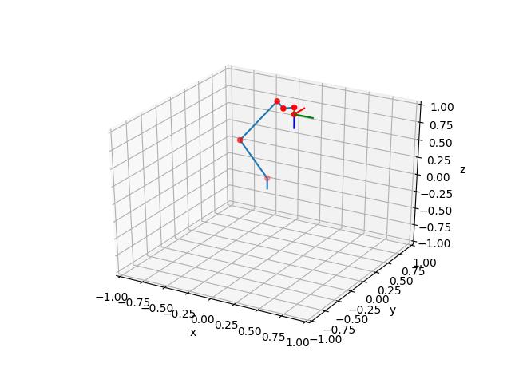
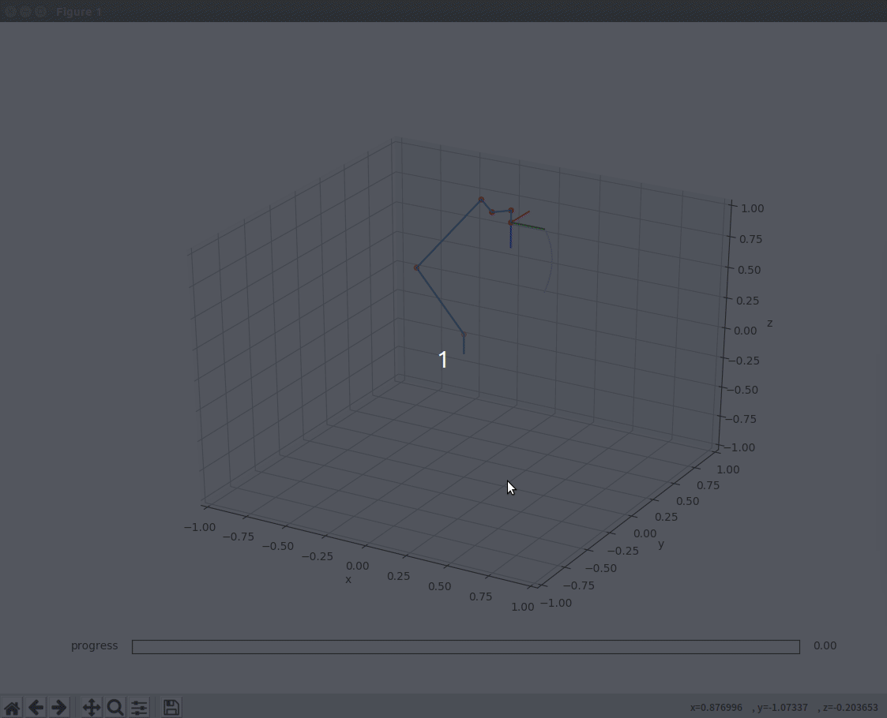
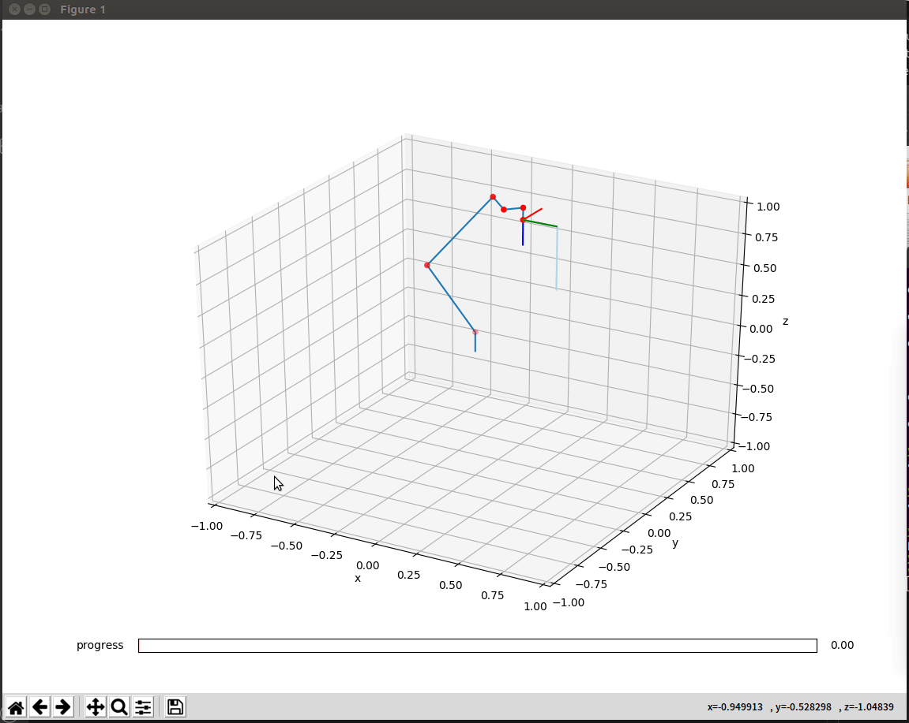
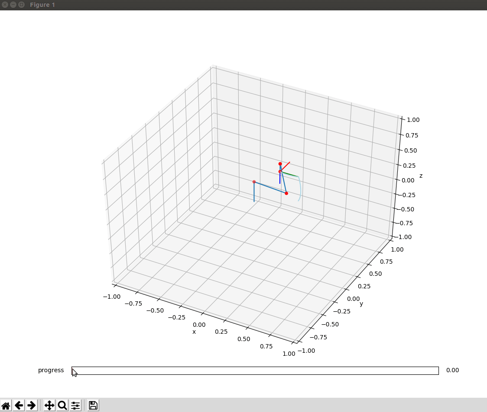

# Visual-Kinematics

This is a super easy-to-use and helpful python package for calculating the robot kinematics and visualizing trajectory in just a few lines of code.  

You don't have to deal with vector and matrix algebra or inverse kinematics. As long as there are robot's D-H parameters, you are good to go.

If you are unfamiliar with D-H parameters, please refer to [here](https://en.wikipedia.org/wiki/Denavit%E2%80%93Hartenberg_parameters).  

# Install via pip

```
pip3 install visual-kinematics
```

# Explanation of example codes

## forward . py

```python
dh_params = np.array([[0.163, 0., 0., 0.5 * pi],
                      [0., 0.5 * pi, 0.632, pi],
                      [0., 0., 0.6005, pi],
                      [0.2013, -0.5 * pi, 0., -0.5 * pi],
                      [0.1025, 0., 0., 0.5 * pi],
                      [0.094, 0., 0., 0.]])
robot = Robot(dh_params)
```

To initialize an instance of Robot, DH parameters need to be provides. They should be given by an **n*4** matrix, where **n** is the number of axes the robot has, most commonly six.

The matrix should be in following format:

|   d   | theta |   a   | alpha |
| :---: | :---: | :---: | :---: |
|   x   |   x   |   x   |   x   |
|   x   |   x   |   x   |   x   |
|  ...  |  ...  |  ...  |  ...  |

In this case, we use the DH parameters of [Aubo-i10](https://aubo-robotics.com/products/aubo-i10/).

```python
theta = np.array([0., 0., -0.25 * pi, 0., 0., 0.])
f = robot.forward(theta)
```

To calculate the forward kinematics, we need to specify 6 axis angles. And the function returns end frame of the robot.  

You can also get the end frame by calling the Robot's property *end_frame*:
```python
robot.end_frame
```

From the Frame object we can easily get the translational part and rotational part in different formats(rotaion matrix, eular angle, angle-axis and quaternion).

```python
print("-------forward-------")
print("end frame t_4_4:")
print(f.t_4_4)
print("end frame xyz:")
print(f.t_3_1.reshape([3, ]))
print("end frame abc:")
print(f.euler_3)
print("end frame rotational matrix:")
print(f.r_3_3)
print("end frame quaternion:")
print(f.q_4)
print("end frame angle-axis:")
print(f.r_3)
```
Result:
> -------forward-------  
end frame t_4_4:  
[[ 0.707 -0.707 -0.    -0.497]  
 [-0.     0.    -1.    -0.295]  
 [ 0.707  0.707 -0.     1.292]  
 [ 0.     0.     0.     1.   ]]  
end frame xyz:  
[-0.497 -0.295  1.292]  
end frame abc:  
[-0.    -0.785  1.571]  
end frame rotational matrix:  
[[ 0.707 -0.707 -0.   ]  
 [-0.     0.    -1.   ]  
 [ 0.707  0.707 -0.   ]]  
end frame quaternion:  
[ 0.653 -0.271  0.271  0.653]  
end frame angle-axis:   
[ 1.482 -0.614  0.614]  

And we can visualize the Robot by just:

```python
robot.show()
```

And the result:  


## inverse . py

Visual-Kinematics utilizes numerical method to solve inverse kinematics, so you don't have to solve the analytical solution by hand. However, if you solved it for your robot and want to implement, a later example will show how to do that. After all analytical solution runs much faster and can be more reliable.

To calculate the axis angles, a end frame needs to provided. It can also be constructed in various formats (translation vector + rotaion matrix, eular angle, angle-axis or quaternion). Here we use ZYX eular angle (intrinsic rotations).

```python
xyz = np.array([[0.28127], [0.], [1.13182]])
abc = np.array([0.5 * pi, 0., pi])
end = Frame.from_euler_3(abc, xyz)
robot.inverse(end)
```

And the robot is already configured to the wanted pose. To get access to axis values, we call for the property *axis_values*.

```python
print("axis values: ")
print(robot.axis_values)
```

And the result:

>axis values:   
[ 0.798  0.422  1.049 -0.943  1.571  0.798]



## trajectory . py

Apart from solving kinematics for a single frame, Visual-Kinematics can also be used for trajectory visualizatiion.

To do that, we need to specify some frames along the trajectory.

```python
trajectory = []
trajectory.append(Frame.from_euler_3(np.array([0.5 * pi, 0., pi]), np.array([[0.28127], [0.], [1.13182]])))
trajectory.append(Frame.from_euler_3(np.array([0.25 * pi, 0., 0.75 * pi]), np.array([[0.48127], [0.], [1.13182]])))
trajectory.append(Frame.from_euler_3(np.array([0.5 * pi, 0., pi]), np.array([[0.48127], [0.], [0.63182]])))
```

 In this case, we define trajectory using 3 frames. To visulize it, just:

```python
robot.show_trajectory(trajectory, motion="p2p")
```

The method can be either "p2p" or "lin", which stands for point-to-point movement and linear movement. The first one interpolates in the joint space while the second one in cartesian space.

(Note: Currently it doesn't support specifying the motion type for each segment. Future development will focus on that.)

The result:



## analytical_inv . py

While defining the robot, we can set an analytical solution for solving its inverse kinematics.

```python
def aubo10_inv(dh_params, f):
    # the analytical inverse solution
    # ...
    return theta

robot = Robot(dh_params, analytical_inv=aubo10_inv)
```

If you look at the code, the function ***aubo10_inv*** in this case is quite complicated. We don't go into details about how it is derived. Just make sure that is takes in the ***n\*4*** matrix containning all the DH parameters as well as a end frame, and returns an 1d-array representing n axis values.

This time let try the linear movement:

```python
robot.show_trajectory(trajectory, motion="lin")
```

Result:



## 7-axis . py

It is pretty much the same to work with seven axis robots. The only differentce is the DH parameter becomes a ***7\*4*** matrix instead of a ***6\*4*** one.

Here we use the DH parameters of [KUKA LBR iiwa 7 R800](https://www.kuka.com/en-au/products/robotics-systems/industrial-robots/lbr-iiwa).

```python
dh_params = np.array([[0.34, 0., 0., -pi / 2],
                      [0., 0., 0., pi / 2],
                      [0.4, 0., 0., -pi / 2],
                      [0., 0., 0., pi / 2],
                      [0.4, 0., 0., -pi / 2],
                      [0., 0., 0., pi / 2],
                      [0.126, 0., 0., 0.]])
```

The result:



(Note: You see only 4 red dots, because the the frames of the 1st and 2nd axes share the same origin, so do the 3rd and the 4th, the 5th and the 6th.)
